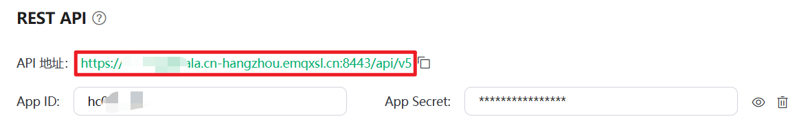

# 短信提醒助手 SMS Notify

## 简介

本工具是Windows桌面应用，通过接收MQTT消息实现消息同步通知，配合 [pppscn/SmsForwarder: 短信转发器 (github.com)](https://github.com/pppscn/SmsForwarder) 使用可实现将手机短信推送到PC端提醒，并且可以自动复制验证码，方便了PC端验证码的接收

## 使用教程

#### 1. 创建MQTT服务器

首先，你需要一个MQTT服务端，这里我使用了EMQX Cloud提供的免费Serverless MQTT服务部署[EMQX Cloud 控制台](https://cloud.emqx.com/console/deployments/new)，每个月可以提供100万连接分钟、1GB流量的免费额度，转发短信完全够用了。


在部署完成后，获取连接信息备用


#### 2. 新建应用

点击 “新建应用” 获取App ID和 App Secret，由于SMS Forwarder并不支持MQTT with TLS，而免费的EMQX部署只能使用MQTT with TLS，所以这里我们使用 SMS Forwarder 的 Webhook 功能，使用RestAPI把消息推送到MQTT。


#### 3. 新建认证

点击认证鉴权，创建用户名和密码，该用户名和密码用于连接到MQTT服务器，后续需要填写在本工具的配置文件中。


#### 4. 下载运行本应用

第一次运行会提示 “请先配置配置文件” 并在软件同目录创建 config.json，请打开 config.json 进行编辑


```json
{
  "MqttAddress": "", // 第1步中的Mqtt连接地址
  "MqttPort": 8333, // 第1步中的端口
  "MqttUsername": "", // 上一步创建的用户名
  "MqttPassword": "", // 上一步创建的密码
  "MqttTopic": "", // 随便创建一个Mqtt主题，和手机端使用的相同即可，比如receive_sms
  "EnableAutoCopy": true, // 是否自动复制验证码
  "ShowAllSms": true // 是否提示所有短信，或是只提示验证码
}
```

请按照介绍，正确配置 config.json，不要包含这些注释，配置完成后重新启动应用

如果配置正确，你将会在右下角托盘中看到这样的软件图标（如果没有，就在收起的托盘图标中找找）


双击图标，即可打开程序的主界面，当你看到 MQTT客户端已连接字样时，说明已经成功连接到MQTT服务器，至此电脑端配置完毕


关闭窗口并不会退出程序，如果需要退出程序，请右键托盘图标，点击退出程序


#### 5. 下载安装手机端应用

https://github.com/pppscn/SmsForwarder/releases/download/v3.2.0/SmsForwarder_release_3.2.0_100050_20230214_universal.apk

下载安装 SmsForwarder

[Home · pppscn/SmsForwarder Wiki (github.com)](https://github.com/pppscn/SmsForwarder/wiki)

请根据Wiki中内容，授权 SmsForwarder 读取短信需要的系统权限（某些系统中，还需要关闭手机的验证码保护功能）


#### 6. 配置发送通道

打开 SmsForwarder，下方Tab选择发送通道，创建一个WebHook类型的发送通道


**通道名称 **填写 EMQX（这里随意）

**请求方式** 选择 POST

**Webhook Server **填写EMQX的Rest API地址




**消息模板 **填写 

```json
{"topic": "第4步中配置的MqttTopic","qos": 0,"payload": "[msg]"}
```


**计算RestAPI鉴权码**

使用上方的 App ID 和 App Secret，用英文冒号进行拼接

假如App ID为: abcd，App Secret为: efg，则拼接后为 abcd:efg

将拼接后的内容，用工具转换成Base64编码，工具可以使用 [Base64 在线编码解码 | Base64 加密解密 - Base64.us](https://base64.us/)：


此处 YWJjZDplZmc= 就是我们需要的鉴权码


**添加Headers**

Key填写 Authorization

Value填写 Basic 鉴权码，比如 Basic YWJjZDplZmc=


#### 7. 测试发送通道

在PC端应用打开的情况下，点击手机端的 “测试” 按钮，如果顺利，你将能在电脑上看到这样的提示，那么恭喜你，Mqtt配置成功：


成功后，在手机端点击保存，保存发送通道


#### 8. 配置转发规则

新建一个转发规则，发送通道选择你此前配置的发送通道，我这里是EMQX，选择启用自定义模板，内容为

```
{{来源号码}}
{{短信内容}}
```


点击测试，输入来源号码 123，测试短信内容 123456，点击测试规则，如果一切顺利，你可以看到电脑端弹出了消息提醒，并且成功提取出了验证码


成功后，点击保存，保存转发规则


#### 9. 完成

至此，所有配置已完成，你可以根据需要，将本程序设置为电脑的开机启动项
